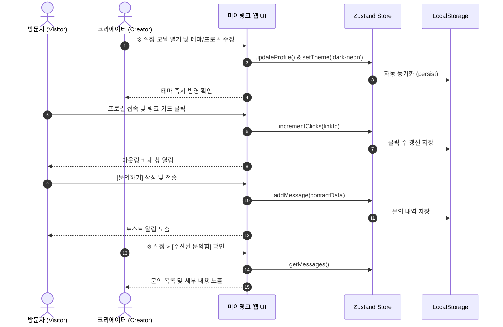

# [PRD] 마이링크 (MyLink) - 링크트리 클론 서비스 제품 요구사항 정의서

> **문서 버전**: v1.4  
> **최종 수정일자**: 2026-09-29  
> **상태**: Approved (사용자 시나리오 추가 완료)

---

## 1. 개요 (Product Overview)

### 1.1 제품 정의
**마이링크(MyLink)**는 크리에이터, 프리랜서, 1인 기업이 자신의 다양한 SNS 채널, 포트폴리오, 작업 링크를 단 하나의 고유 URL로 통합하고, 방문자와의 소통(문의/리드 수집)을 극대화할 수 있는 **링크-인-바이오(Link-in-Bio) 및 미니 프로필 서비스**입니다.

### 1.2 기획 배경 및 목적
- SNS(인스타그램, 유튜브, X 등) 프로필에 등록 가능한 링크 개수의 한계 극복
- 단순 링크 나열을 넘어 **소셜 아이콘 연동**, **문의 폼(Lead Generation)**, **다양한 테마 커스터마이징**을 통해 개인 브랜딩 강화
- 메인 화면의 미니멀리즘 유지: 테마 스위처 등 복잡한 설정은 **'설정(Settings)' 모달**에 숨겨두고, 사용자가 원할 때 언제든 변경 가능하도록 설계
- 브라우저 **LocalStorage 영속성**을 통해 별도 백엔드 연결 전에도 모든 데이터(링크, 프로필, 테마, 문의 내역)가 안전하게 유지

---

## 2. 타깃 사용자 & 핵심 페르소나 (Target Audience)

- **주요 타깃**: 크리에이터, 프리랜서(디자이너/개발자/작가), 1인 사업가 및 인플루언서
- **페르소나 예시**:
  - **김민지 (28세, 프리랜서 UI/UX 디자이너 & 인스타툰 작가)**: 인스타그램 프로필에 올릴 단 하나의 감각적인 링크가 필요함. 포트폴리오(Behance), 브런치 글, 외주 문의를 한곳에서 받고 싶어 함.
  - **이준호 (32세, 1인 테크 크리에이터)**: 유튜브, 깃허브, 뉴스레터 구독 링크를 공유하고 다크 모드/네온 감성의 테마를 적용하고 싶어 함.

---

## 3. 사용자 여정 및 핵심 시나리오 (User Scenarios & Journey)

### 3.1 [시나리오 1] 크리에이터(소유자)의 첫 페이지 세팅 및 테마 커스텀
1. **페이지 접속**: 크리에이터가 마이링크에 처음 접속한다.
2. **프로필 & 테마 설정**:
   - 우측 상단 헤더의 **⚙️ [설정]** 아이콘을 클릭하여 설정 모달을 연다.
   - 프로필 이미지 URL, 활동명(이름), 한 줄 소개(바이오)를 입력한다.
   - 인스타그램, 유튜브, 깃허브 등 보유한 SNS 링크를 입력한다.
   - **8종 테마 프리뷰** 중 자신의 분위기에 맞는 테마(예: `Soft Pastel` 또는 `Cyberpunk Dark`)를 선택하고 **[저장하기]**를 누른다.
3. **링크 카드 등록**:
   - 상단의 **[+ 링크 추가]** 버튼을 눌러 대표 작업물(예: '2026 포트폴리오 노션', '최신 유튜브 영상')의 제목과 URL, 설명을 입력하고 등록한다.
4. **결과 확인 및 영속성**:
   - 새로고침을 하거나 브라우저를 다시 켜도 자신이 설정한 테마와 링크들이 그대로 유지되는 것을 확인한다.

---

### 3.2 [시나리오 2] 방문자의 프로필 탐색 및 링크 아웃링크 이동
1. **방문**: 인스타그램 프로필 링크를 타고 크리에이터의 마이링크 페이지에 모바일로 접속한다.
2. **첫인상 경험**: 크리에이터가 지정한 세련된 비주얼 테마(배경, 폰트, 카드 스타일)와 프로필 정보를 확인한다.
3. **소셜 채널 탐색**: 프로필 하단에 정렬된 소셜 아이콘(Instagram, YouTube 등)을 터치하여 해당 채널로 즉시 이동한다.
4. **링크 탐색 및 클릭**: 
   - 관심 있는 링크 카드를 탭한다.
   - 부드러운 터치 애니메이션과 함께 새 탭으로 대상 웹페이지(포트폴리오 등)가 열린다.
   - 동시에 해당 링크 카드의 **클릭 수(Click Count)** 지표가 1 증가한다.

---

### 3.3 [시나리오 3] 방문자의 외주/협업 문의 전송 및 크리에이터의 확인
1. **문의 작성 (방문자)**:
   - 방문자가 크리에이터에게 협업을 제안하고자 프로필 카드 아래의 **[문의하기]** 버튼을 클릭한다.
   - 이름/회사명, 회신받을 이메일 주소, 문의 제목, 프로젝트 세부 내용을 작성하고 **[보내기]**를 클릭한다.
   - 화면 하단에 *"문의가 성공적으로 전달되었어요!"*라는 TDS 스타일 토스트 메시지가 뜬다.
2. **문의 확인 (크리에이터)**:
   - 크리에이터는 헤더의 **⚙️ [설정]** > **[수신된 문의함]** 탭으로 들어간다.
   - 방문자가 보낸 이름, 이메일, 작성 일시, 문의 본문을 확인하고 **[읽음 처리]** 또는 **[메일로 답장하기]**를 클릭한다.

---

## 4. 시스템 역할 및 권한 (User Roles & Permissions)

| 사용자 역할 | 주요 기능 및 권한 |
| :--- | :--- |
| **관리자/프로필 소유자 (Creator)** | • **설정(Settings) 모달**에서 프로필 편집 및 8종 테마 선택<br>• 링크 카드 CRUD 및 클릭 수 확인<br>• 소셜 미디어 링크 설정<br>• 수신된 문의 폼 메시지 내역 확인<br>• 모든 데이터는 브라우저 **LocalStorage에 자동 저장 및 복원** |
| **방문자 (Visitor)** | • 소유자가 설정한 테마로 렌더링된 프로필 페이지 조회<br>• 링크 카드 및 소셜 아이콘 클릭 이동<br>• 문의 폼(Contact Form) 작성 및 메시지 전송 |

---

## 5. 핵심 기능 요구사항 (Core Feature Requirements)

### 5.1 설정 모달 (Settings Modal)
- 헤더의 ⚙️ 설정 아이콘 클릭 시 오픈
- **테마 선택기 (Theme Picker)**: 8종 테마 프리뷰 카드 중 하나를 선택하고 '저장' 시 즉시 화면에 테마 스타일 바인딩
- **프로필 설정**: 이름, 닉네임, 아바타 이미지 URL, 한 줄 바이오 수정
- **소셜 링크 관리**: GitHub, Instagram, YouTube, LinkedIn, X, Email 등 URL 수정
- **수신된 문의함**: 방문자 메시지 목록 확인, 읽음 상태 토글, 삭제

### 5.2 8종 테마 프리셋 라인업 (Themes Lineup)

| 테마 ID | 테마 이름 | 비주얼 특징 & 분위기 |
| :--- | :--- | :--- |
| `toss` | **Toss Blue (기본)** | 토스 특유의 산뜻한 블루(`#3182f6`), 오프화이트 배경, 깔끔한 라운드 카드 |
| `dark-neon` | **Cyberpunk Dark** | 딥 다크/슬레이트 배경에 빛나는 네온 시안/라임 액센트와 은은한 글로우 효과 |
| `soft-pastel` | **Peach Pastel** | 복숭아빛 & 라벤더 파스텔 그라데이션, 둥글둥글하고 포근한 소프트 무드 |
| `minimal-mono` | **Minimalist Mono** | 흑백의 미학, 극도로 절제된 라인과 간결한 타이포그래피 |
| `neo-brutalism`| **Neo Brutalism** | 굵은 3px 블랙 외곽선과 강렬한 원색(옐로우/핑크), 통통 튀는 하드 섀도우 |
| `forest-calm` | **Forest Calm** | 세이지 그린과 포레스트 딥 그린, 자연 친화적이고 안정감 있는 오가닉 톤 |
| `sunset-glow` | **Sunset Gradient**| 오렌지-핑크-바이올렛 석양빛과 세련된 글래스모피즘(반투명 유리) |
| `mac-retro` | **90s Mac OS Retro**| 클래식 Mac OS 창틀과 베이지/그레이 레트로 감성 & 픽셀 섀도우 |

### 5.3 링크 카드 관리 (Link Management)
- 링크 카드 등록/수정/삭제: 제목, 설명, 이동 URL, 커스텀 아이콘 선택
- 링크 활성화/비활성화 (On/Off 토글)
- 실시간 클릭 수(Click Count) 집계 및 노출

### 5.4 문의/리드 수집 폼 (Contact Form & Lead Gen)
- 방문자용 직관적인 문의 모달 (이름, 이메일, 제목, 메시지)
- 전송 완료 시 실시간 토스트 알림 제공

---

## 6. 상태 관리 & 저장소 아키텍처 (State & Storage)

### 6.1 Zustand + `persist` 미들웨어 (LocalStorage)
- 모든 스토어 데이터는 `localStorage`에 자동 직렬화/역직렬화되어 브라우저에 영구 보존됩니다.

```
src/store/
├── useLinkStore.ts      # links (CRUD, clicks) -> LocalStorage ('mylink-links')
├── useProfileStore.ts   # profile, theme, socials -> LocalStorage ('mylink-profile')
├── useContactStore.ts   # messages -> LocalStorage ('mylink-contacts')
└── useToastStore.ts     # UI 토스트 알림 (비영속 메모리 상태)
```



---

## 7. 기술 스택 (Tech Stack)

- **Frontend Framework**: Next.js 15+ (App Router)
- **Language**: TypeScript
- **Styling**: Tailwind CSS, PostCSS
- **State Management**: Zustand (+ `persist` middleware)
- **Icons**: Lucide React, Custom Brand SVGs
- **Deployment**: Vercel

---

## 8. 마일스톤 및 단계별 개발 로드맵 (Milestones)

### Phase 1: Zustand & 8종 테마 & 설정 모달 완성 (현재)
- [x] 프론트엔드 모바일 퍼스트 인터페이스 & 기본 컴포넌트 구조화
- [ ] `zustand` 라이브러리 설치
- [ ] `src/store/` 디렉토리에 4개 스토어 구현 (`persist` 적용)
- [ ] `src/constants/themes.ts` 8종 테마 토큰 정의 및 컴포넌트 테마 연동
- [ ] 헤더 내 **⚙️ 설정(Settings) 모달** 추가 (테마/프로필/문의함 관리)

### Phase 2: Supabase 풀스택 연동 및 다중 사용자 확장
- [ ] Supabase Auth (로그인/회원가입/세션)
- [ ] PostgreSQL 테이블 생성 및 Zustand Store와 비동기 연동
- [ ] 고유 URL 라우팅 (`/@username`)

### Phase 3: 분석 및 부가 기능
- [ ] 방문자 유입 경로 및 링크 클릭 애널리틱스 차트
- [ ] 간편 후원/결제 링크 위젯 (Toss/카카오페이)
